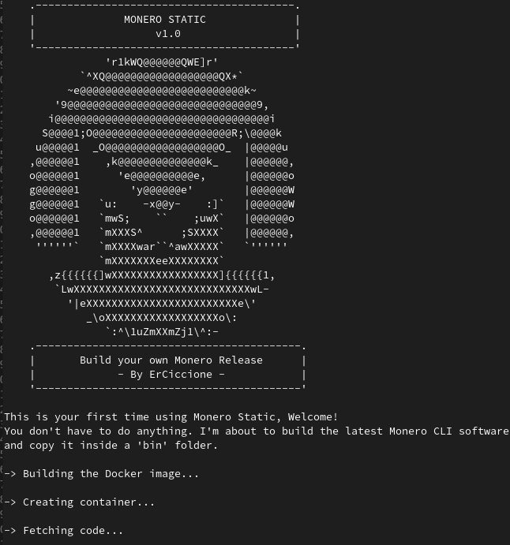

Monero Static is a simple tool that allows to build your own release of the Monero CLI and daemon. It removes the need to trust third parties, keeps your computer free of Monero specific dependencies and allow to test the newest functionalities not yet included in official releases.

This repository contains a Dockerfile and a bash script. The script runs the Dockerfile and will start building the latest Monero software as soon as it's launched. The script will create a reusable image that can be used every time you want to have an updated version of the Monero software. After compilation, the resulting binaries will be available in a 'bin' folder.  
The first time you launch the script, it will take some time to build the dependencies and the softwate, but as said above, once the image is installed you can reuse it multple times, decreasing dramatically the amount of time needed to build the software.

If the image is already installed, you will be asked if you want to build 'master' or the latest release (currently 0.16.0.0). The 'master' branch contains all the current progresses of the monero developers and it's considered unstable, if you don't care about testing new fancy features, just build the latest stable release.

The script is tested on Debian Buster and Ubuntu 18 and could not work in other distributions.

Make sure to install the necessary dependencies, then run the script by using the command `./run.sh`

### Install the dependencies

Run in the terminal:
```
sudo apt install git docker.io
```
If possible, use your packaging system to get docker. For example, on Debain based distros docker can be installed by simply running `sudo apt install docker.io`

Take a look at [the official documentation](https://docs.docker.com/engine/install/) for details.

### Preview


## Manually build and copy the binaries
If the script doesn't work for you, proceed by using docker manually.


### 2. Clone this repository and navigate into the directory

```
git clone https://github.com/erciccione/monero-static-docker.git
cd monero-static-docker
```

### 3. Build the docker image and create a container based on it

```
docker build . -t monero-static-docker
```
This will take some time. Just sit back and wait until your computer is done compiling, then run the following command to create a container based on the docker image you just built. The binaries will be there, waiting to be copied to your system.
```
docker run -it --rm --name monero-static monero-static-docker
```


### 4. Copy the freshly built binaries to yur host system
Run this command from outside your container. Meaning you need to lunch another terminal window.
```
docker cp monero-static:/home/monero/build/Linux/master/release/bin <DESTINATION FOLDER IN THE HOST SYSTEM>
exit
```

The container will be destroyed right after we leave it, but the `monero-static-docker` image is still there and contains the monero git repository with all the static dependencies already compiled. That means when the upstream repository gets updated, we can just create a container based on the image we already built, pull the changes and build Monero again.

### Reuse the image everytime you want to make your own release

#### Create a container based on the docker image, as we did before
```
docker run -it --rm --name monero-static monero-static-docker
```
#### Pull the changes from the monero repo
```
cd monero && git pull
```

#### Build the new binaries
```
make clean
make release-static
```

#### Copy the binaries to the host machine
```
docker cp monero-static:/home/monero/build/Linux/master/release/bin <DESTINATION FOLDER IN THE HOST SYSTEM>
```
